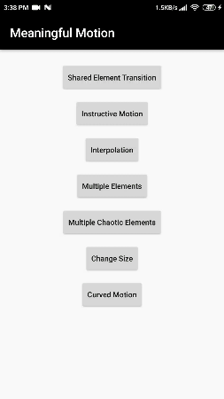

# MeaningfulMotion

This app all about using efficient Motion to improve User experience.
Directly helped from Udacity Material Design Course https://classroom.udacity.com/courses/ud862/lessons/4969789009/concepts/50574251680923
and Their repository in github : https://github.com/udacity/ud862-samples

### Shared Emelenet Transition

  

### Instructive Motion

  

### Interpolation

  

### Multielment Motion

  

### Chaotic Motion

  

### Curve Transforation

  

